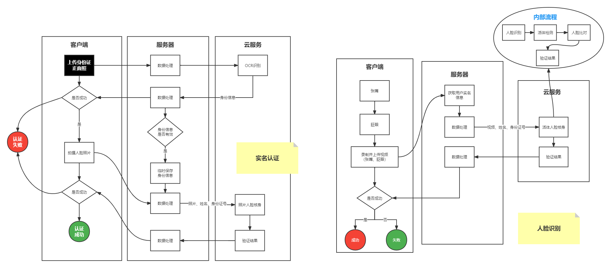

# 相关文档

## 需要开通的服务

卡证识别：[卡证文字识别_证件文字识别_银行卡文字识别-腾讯云 (tencent.com)](https://cloud.tencent.com/product/cardocr)

人脸核身：[人脸核身_身份认证__实名认证_实人认证-腾讯云 (tencent.com)](https://cloud.tencent.com/product/faceid)

## 服务端配置

秘钥配置：[访问密钥 - 控制台 (tencent.com)](https://console.cloud.tencent.com/cam/capi)

公共参数：[人脸核身 公共参数-调用方式-API 中心-腾讯云 (tencent.com)](https://cloud.tencent.com/document/api/1007/31323)

## 前端传入参数说明

前端需要传入的照片或者视频：格式为`File`

>File：可以通过读取Buffer将其转为Base64，用Base64作为腾讯云接口的参数
>
>为什么用File而不直接用base64：普通类型的请求体有大小限制，需要用`multipart-formData`类型上传文件
>
>需要约定好formData的字段，方便后端读取

## 实名认证

### Step-1：OCR身份证识别

功能概述：[文字识别 卡证文字识别-产品简介-文档中心-腾讯云 (tencent.com)](https://cloud.tencent.com/document/product/866/37491)

API说明文档：[文字识别 身份证识别-服务端 API 文档-文档中心-腾讯云 (tencent.com)](https://cloud.tencent.com/document/product/866/33524)

### Step-2：照片人脸核身

功能概述：[人脸核身 照片人脸核身-人脸核身PaaS服务相关接口-API 中心-腾讯云 (tencent.com)](https://cloud.tencent.com/document/api/1007/31820)

API说明文档：[API Explorer - 云 API - 控制台 (tencent.com)](https://console.cloud.tencent.com/api/explorer?Product=faceid&Version=2018-03-01&Action=ImageRecognition&SignVersion=)

识别相似度：推荐相似度大于等于70时可判断为同一人，可根据具体场景自行调整阈值（阈值70的误通过率为千分之一，阈值80的误通过率是万分之一）

## 人脸识别

### Step-1：服务端获取实名认证中身份识别保存的身份信息

### Step-2：活体人脸核身

功能概述：[人脸核身 活体人脸核身-人脸核身PaaS服务相关接口-API 中心-腾讯云 (tencent.com)](https://cloud.tencent.com/document/api/1007/31818)

API说明文档：[API Explorer - 云 API - 控制台 (tencent.com)](https://console.cloud.tencent.com/api/explorer?Product=faceid&Version=2018-03-01&Action=LivenessRecognition&SignVersion=)

识别相似度：推荐相似度大于等于70时可判断为同一人，可根据具体场景自行调整阈值（阈值70的误通过率为千分之一，阈值80的误通过率是万分之一）

# 业务流程

